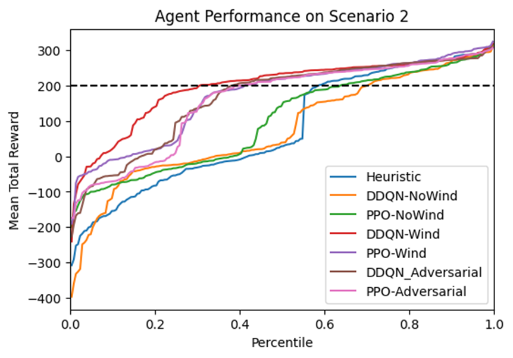

# Adversarial-LunarLander

A project investigating the use of [Double-Deep Q-Networks (DDQN)](https://dilithjay.com/blog/ddqn) and [Proximal-Policy Optimization (PPO)](https://en.wikipedia.org/wiki/Proximal_policy_optimization) for an adversarial version of the [LunarLander-v3](https://gymnasium.farama.org/environments/box2d/lunar_lander/) environment.

  

### Install
This project was developed with Python 3.13.3, but should work in any version as long as all the dependencies (found in `requirements.txt`) are available.
The code is compatible with CUDA, but you will need to manually install the correct [torch](https://pytorch.org/) version.
To use the code as-is, you need to create your own [Weights and Biases](https://wandb.ai/site/) account and log in when prompted through the code.

### Usage
`src/env/CustomLunarLander` is an exact copy of Gym's LunarLander-v3.
This is the super class of `src/env/AdversarialLunarLander`, which has a modified step function that takes in two actions; one for the protagonist (i.e. an agent trying to solve the original problem), and one for the adversary (i.e. an agent trying to stop the protagonist from succeeding).
The action passed to this method should be a tuple in the form of `(protagonist_action, adversary_action)`, with both actions in range `[0, 3]`.

The notebooks in the root can be used to train either a DDQN or PPO agent on either the original LunarLander environment or on the adversarial environment.
All notebooks contain a config dictionary that defines all parameters for the environment and the models.

Further explanation about the topic of adversarial RL, hyperparameter choices, experiments, and results can be found in `slides.pdf`.

### About
Developed by Thomas Vroom, Maastricht University (2025), for the final assignment of the KEN4157 Reinforcement Learning course.

Feel free to modify, adapt, or use the code in any way.
